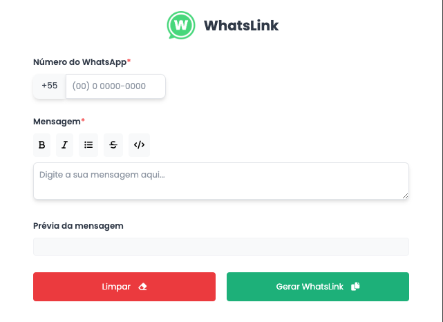

# WhatsLink - WhatsApp Extension

<div align="center">

</div>

## 📝 Description

**WhatsLink** is a browser extension that transforms how you share links and messages on WhatsApp. With an intuitive interface and robust features, this extension allows you to format your messages easily, add lists, codes, and much more, all in one place.

## 🚀 Features

- **Message Formatting**: Add bold, italic, strikethrough, and code to your messages with a simple click.
- **List Insertion**: Create organized item lists with an easy-to-use prompt.
- **Real-Time Preview**: See how your messages will look before sending them.
- **User-Friendly Interface**: Responsive and intuitive design for an enhanced user experience.

## 💻 How to Use

1. **Installation**:

   - Clone the repository:
     ```bash
     git clone https://github.com/eliasacneto/extension-whatslink.git
     ```
   - Navigate to the project folder:
     ```bash
     cd extension-whatslink
     ```
   - Open Chrome and go to `chrome://extensions/`.
   - Enable "Developer mode" in the top right corner.
   - Click "Load unpacked" and select the project folder.

2. **Usage**:
   - Click on the extension icon in the toolbar.
   - Enter your message and use the formatting buttons as needed.
   - Preview the formatted message in real-time before copying it to WhatsApp.

## 🎨 Screenshot



## ⚙️ Technologies Used

- **HTML**: For the structure of the extension.
- **CSS**: For styling and responsive design.
- **JavaScript**: For the logic of the extension.
- **Font Awesome**: For attractive icons.

## 📌 Roadmap

- [ ] Add support for dark and light themes.
- [ ] Improve interface usability.
- [ ] Add more formatting and styling options.

## 📄 License

This project is licensed under the MIT License - see the [LICENSE](LICENSE) file for details.

## 📫 Contact

Elias Neto - [website](http://eliasacneto.vercel.app)

Follow me on [LinkedIn](https://www.linkedin.com/in/eliasacneto) for more updates and projects!
